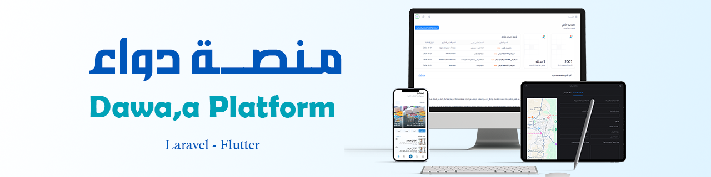
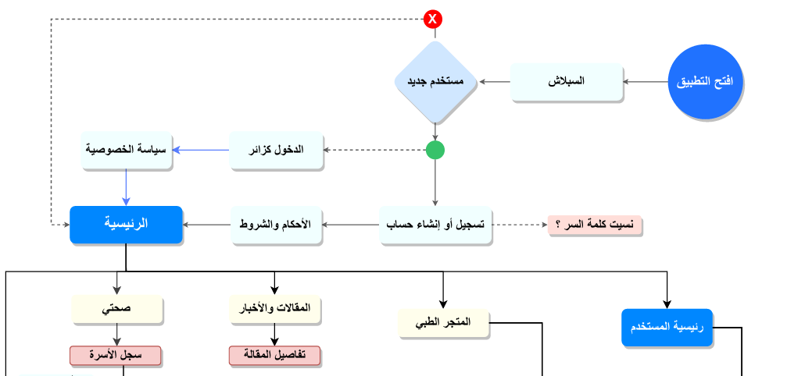
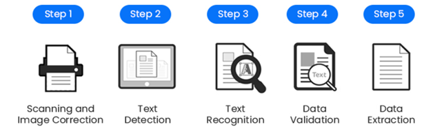
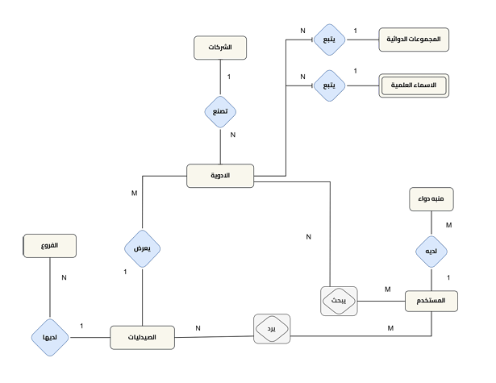
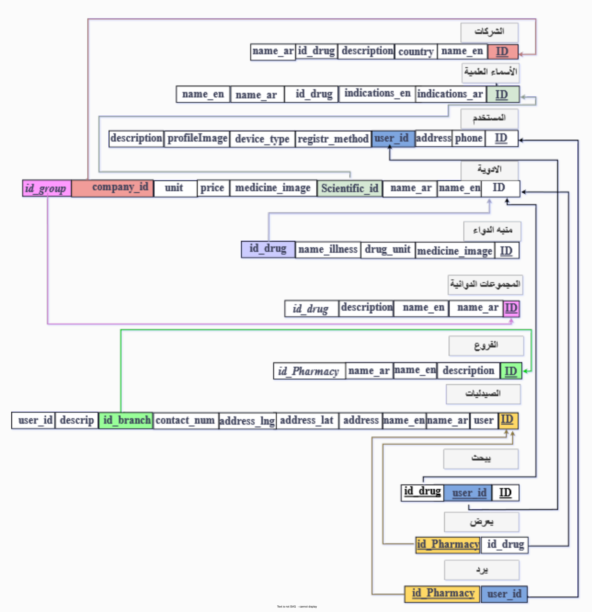
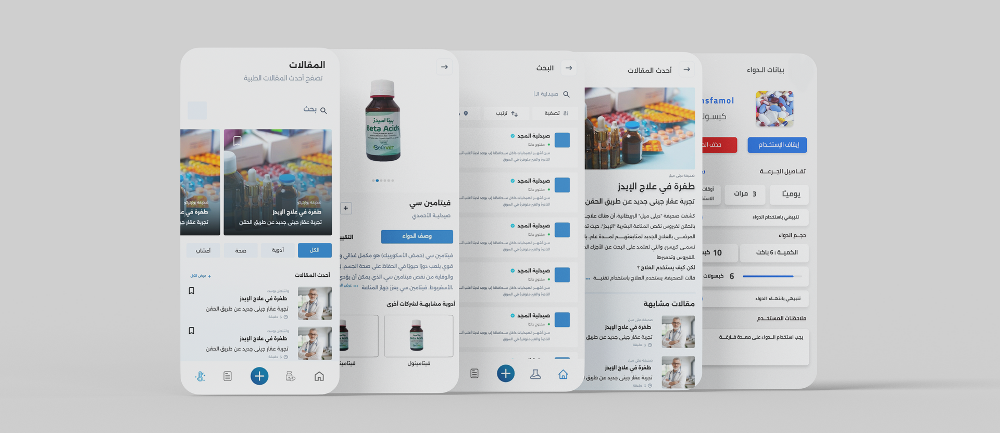

[النسخة العربية ar](README_AR.md)



# Dawaa Platform: Drug Recognition and Search Using Advanced Optical Character Recognition (OCR) 🚀

[](https://github.com/Al-shwaib/Dawaa-Platform/stargazers)
[](https://github.com/Al-shwaib/Dawaa-Platform/commits/main)
[](https://github.com/Al-shwaib/Dawaa-Platform/actions)


A comprehensive project aimed at facilitating the lives of patients and pharmacists through a smart platform to recognize drugs from images, search for them, and provide up-to-date health content. The platform offers a seamless user experience via a mobile app and a professional website.

> **The system is built using Flutter for the mobile app and Laravel for the website.**

---

## 📑 Table of Contents
- [Educational Background](#educational-background-🏫)
- [General Overview](#general-overview)
- [Tech Stack](#tech-stack)
- [Getting Started](#getting-started-🚦)
- [Project Structure](#project-structure-📁)
- [Main Objectives](#main-objectives-🎯)
- [System Components](#system-components-🧩)
- [Technologies Used](#technologies-used-🛠️)
- [Designs and Diagrams](#designs-and-diagrams-📐)
- [Main User Interfaces](#main-user-interfaces-🖼️)
- [Pharmacy Registration Process](#pharmacy-registration-process-🏥)
- [Team Members](#team-members-👨‍💻)
- [Contact & Support](#contact--support-✉️)

---

## Educational Background 🏫
Graduation Project – Ibb University, Yemen, Department of Computer Science and Information Technology, Faculty of Science.

---

## General Overview

Patients face significant challenges in identifying drugs, obtaining accurate information, and finding them in suitable pharmacies. The "Dawaa" platform addresses these issues through an intelligent system that integrates artificial intelligence techniques (especially image processing and OCR) to facilitate drug recognition, search, and provide up-to-date pharmaceutical and health information, in addition to supporting pharmacists and medical students.

---

## 🧰 Tech Stack

| Category               | Technology/Tool                     |
|------------------------|-------------------------------------|
| Mobile Language        | Dart                                |
| Mobile Framework       | Flutter                             |
| Backend Language       | PHP 8.2                             |
| Backend Framework      | Laravel                             |
| Database               | MySQL Server, SQFLite               |
| Artificial Intelligence| Google Text Recognition (OCR)       |
| Frontend Technologies  | HTML, CSS, JS, Tailwind CSS         |
| State Management       | GetX (with feature-based structure) |
| Dev Tools              | GitHub, Postman, Android Studio     |

---

## 📁 Project Structure

```
pharmacy-platform/
│
├─ backend/           # Website (Laravel)
│    ├─ app/
│    ├─ routes/
│    └─ ...
│
├─ mobile/            # Mobile App (Flutter)
│    ├─ lib/
│    │    ├─ features/   # Feature-based structure with GetX for state management and navigation
│    │    ├─ core/
│    │    └─ ...
│    ├─ assets/
│    └─ ...
│
├─ assets/            # Diagrams and UI images
│
├─ README.md          # Main documentation file
└─ ...
```

---

## Main Objectives 🎯
- Enable users to recognize drugs from images.
- Provide detailed and accurate information about drugs.
- Facilitate drug search in pharmacies and display their locations.
- Help users adhere to medication schedules (medication reminder).
- Increase users' health awareness.
- Provide a platform for pharmacists to manage and update drug data.
- Serve the pharmacist and medical student community with up-to-date information.

---

## System Components 🧩

### 1. Mobile App for End Users 📱
- **Drug recognition from images** (OCR).
- **Medication reminder** for user notifications.
- **Pharmacy search** and map display.
- **Health content:** Latest articles and medical information.

### 2. Website 💻
- **Pharmacist interfaces:** Register and manage pharmacy/drug data.
- **Admin interface:** Review pharmacy requests, manage accounts, and drug database.

---

## Methodology ⚙️

The project followed the **Agile – Scrum** methodology:
- **Product Owner:** Defines requirements and priorities.
- **Scrum Master:** Organizes schedule and coordination.
- **Technical Team:** Software development and task execution.
- Work is divided into short development cycles (Sprints) with continuous review and improvement.

---

## 🛠️ Technologies Used

### 1. Programming Languages 💻
- **Dart:** Mobile app development.
- **PHP 8.2:** Website development.

### 2. Frameworks & Platforms 🧩
- **Flutter:** Mobile app.
- **Laravel:** Website backend.

### 3. Databases 🗄️
- **SQFLite:** Local mobile database.
- **MySQL Server:** Main database for the website.

### 4. AI & Data Processing 🤖
- **OCR (Google Text Recognition):** Optical character recognition from images.
- **Web Scraping:** Data extraction from websites (using dio, html).

### 5. Frontend Technologies 🎨
- **HTML, CSS, JavaScript:** Building and styling user interfaces.
- **Tailwind CSS:** Responsive UI framework.

### 6. Backend & System Management 🔒
- **Jetstream:** User management in Laravel.
- **Laravel Passport:** OAuth2 authentication.
- **Spatie Permission:** Role and permission management.
- **Fetch API with CSRF protection:** Secure server communication.

### 7. Development & Testing Tools 🧰
- **GitHub:** Source code management and collaboration.
- **Visual Studio Code:** Versatile code editor.
- **Android Studio:** Android app development environment.
- **Postman:** API testing and documentation.

### 8. UI/UX Support Tools 🎯
- **Laravel Localization:** Multi-language support.
- **SweetAlert2:** Interactive and attractive alerts.
- **KeenIcons:** Icon library for enhanced UX.
- **Google Maps API:** Interactive maps in app and website.

### 9. Documentation & Analysis Tools 📊
- **ChatUML**, **draw.io**: Drawing and analyzing diagrams and software charts.

### Design Tools 🖌️
- **Adobe XD:** UI/UX and design system creation.
- **draw.io:** Drawing diagrams (ERD, charts, data flows, etc).
> **Note:** These tools were actually used in the design and documentation of the project, even if not mentioned in the original requirements.

---

## Designs and Diagrams 📐

### Illustrative Diagrams and Images:

1. **Use Case Structure (Partial):**  
   

2. **OCR Data Extraction Steps:**  
   

3. **Drug Recognition Steps:**  
   

4. **Environmental Diagram Data Flow:**  
   

5. **Zero Diagram Data Flow:**  
   

6. **ERD Interactive Entities:**  
   

7. **Schema Diagram (Entity Attribute Relations):**  
   

8. **PERT Timeline (Project Requirements Schedule):**  
   

9. **Design System (Partial):**  
   

### Sample Interfaces:

- **Website Interfaces (Admin & Pharmacist Dashboards):**
    

- **Mobile App Interfaces:**
    
    

---


### Mobile Application

- **Home Page:** Brief of main features, news, notifications, and latest articles.
- **Drug Search Page:** Fast search by name or drug image, with results and details.
- **Pharmacy Map:** Displaying pharmacy locations on a map.
- **Medication Reminder:** Scheduling and notifications for medication times.
- **Health Content:** Latest medical articles and drug information.
- **Profile:** User profile and settings management.

### Website

- **Pharmacist Dashboard:** Register, manage pharmacy and drug data, update profile.
- **Admin Dashboard:** Accept/reject pharmacy registrations, manage users, drugs, and manufacturers.


---

## Pharmacy Registration Process 🏥

1. Pharmacist registers and submits required documents.
2. Admin reviews and accepts/rejects the request.
3. Upon acceptance, the pharmacy can add and manage drugs.
4. If the license expires, the pharmacy must renew to regain access.

### Pharmacy Statuses

| Status           | Description                                                         |
|------------------|---------------------------------------------------------------------|
| Accepted         | The pharmacy is active and can add drugs.                           |
| Rejected         | Registration was rejected or the account was disabled.              |
| License Expired  | The license has expired; the pharmacy cannot operate until renewed. |


---

## Team Members 👨‍💻
- AbdulQuddus Mohammed Abdulwahed Al-Shuwaib
- Abdullah Mohammed Qasim Abdulkarim
- Louay Ahmed Lotf Qasem Al-Khulaifi
- Abdo Mohammed Ahmed Al-Ward
- Abdulaziz Bin Mohammed Bin Abduh Dahan
- Mohammed Abdullah Omar Al-Hadhrami

---

## Contact & Support ✉️

For inquiries: Please contact any team member

> We welcome all suggestions to develop the platform and serve the medical and health community.

---

> Dawaa Platform: Towards Smart and Advanced Healthcare for All 🌟
