[English Version en](README.md)

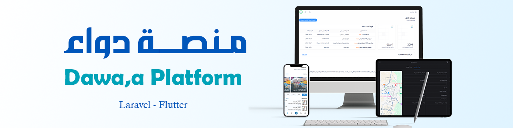

# منصة دواء: التعرف على الدواء والبحث عنه باستخدام التمييز القوي للمحارف 🚀

[](https://github.com/Al-shwaib/Dawaa-Platform/stargazers)
[](https://github.com/Al-shwaib/Dawaa-Platform/commits/main)
[](https://github.com/Al-shwaib/Dawaa-Platform/actions)


مشروع متكامل يهدف إلى تسهيل حياة المرضى والصيادلة عبر منصة ذكية للتعرف على الأدوية بالصور، البحث عنها، وتقديم محتوى صحي محدث، مع دعم كامل لتجربة المستخدم عبر تطبيق جوال وموقع إلكتروني احترافي.

> **تم بناء النظام باستخدام Flutter لتطبيق الجوال وLaravel للموقع الإلكتروني.**

---

## 📑 جدول المحتويات
- [المنشأ التعليمي](#المنشأ-التعليمي-🏫)
- [ملخص عام](#ملخص-عام)
- [التقنيات الأساسية (Tech Stack)](#التقنيات-الأساسية-tech-stack)
- [كيف تبدأ؟](#كيف-تبدأ-🚦)
- [هيكلية المشروع](#هيكلية-المشروع-📁)
- [الأهداف الرئيسية](#الأهداف-الرئيسية-🎯)
- [مكونات النظام](#مكونات-النظام-🧩)
- [التقنيات المستخدمة](#التقنيات-المستخدمة-🛠️)
- [التصميم والمخططات](#التصميم-والمخططات-📐)
- [شرح واجهات المستخدم الرئيسية](#شرح-واجهات-المستخدم-الرئيسية-🖼️)
- [طريقة تسجيل الصيدليات](#طريقة-تسجيل-الصيدليات-في-النظام-🏥)
- [فريق العمل](#فريق-العمل-👨‍💻)
- [التواصل والدعم](#التواصل-والدعم-✉️)

---

## المنشأ التعليمي 🏫
مشروع تخرج – جامعة إب - اليمن، قسم الحاسبات وتكنولوجيا المعلومات، كلية العلوم.

---

## ملخص عام

يواجه المرضى تحديات كبيرة في التعرف على الأدوية والحصول على معلومات دقيقة عنها وإيجادها في الصيدليات المناسبة. تسعى منصة "دواء" إلى معالجة هذه المشكلات عبر نظام ذكي يدمج تقنيات الذكاء الاصطناعي (خاصة معالجة الصور والتعرف الضوئي على الأحرف) لتسهيل التعرف على الأدوية، البحث عنها، وتوفير معلومات دوائية وصحية محدثة، بالإضافة إلى دعم الصيادلة وطلبة الطب.

---

## 🧰 التقنيات الأساسية (Tech Stack)

| الفئة              |          التقنية/الأداة              |
|-------------------------|----------------------------------|
| لغة الجوال              | Dart                            |
| إطار الجوال             | Flutter                         |
| لغة الباك اند           | PHP 8.2                         |
| إطار الباك اند          | Laravel                         |
| قاعدة بيانات            | MySQL Server, SQFLite           |
| ذكاء اصطناعي            | Google Text Recognition (OCR)   |
| واجهات أمامية           | HTML, CSS, JS, Tailwind CSS     |
| أدوات مساعدة            | GitHub, Postman, Android Studio |
| إدارة الحالة في الجوال | GetX (مع تقسيم الميزات)        |

---

## 📁 هيكلية المشروع

```
pharmacy-platform/
│
├─ backend/           #  الموقع الإلكتروني (Laravel)
│    ├─ app/
│    ├─ routes/
│    └─ ...
│
├─ mobile/            #  تطبيق الجوال (Flutter)
│    ├─ lib/
│    │    ├─ features/   # تقسيم الميزات (Feature-based) مع إدارة الحالة والتنقل عبر GetX
│    │    ├─ core/
│    │    └─ ...
│    ├─ assets/
│    └─ ...
│
├─ assets/            # صور المخططات وواجهات المستخدم
│
├─ README.md          # ملف التوثيق الرئيسي
└─ ...
```

---

## الأهداف الرئيسية 🎯
- تمكين المستخدمين من التعرف على الدواء بالصور.
- توفير معلومات تفصيلية ودقيقة عن الأدوية.
- تسهيل البحث عن الأدوية في الصيدليات وتحديد مواقعها.
- مساعدة المستخدمين على الالتزام بمواعيد تناول الأدوية (المنبه الدوائي).
- زيادة الوعي الصحي للمستخدمين.
- توفير منصة للصيادلة لإدارة وتحديث بيانات الأدوية.
- خدمة مجتمع الصيادلة وطلبة الطب بمعلومات محدثة.

---

## مكونات النظام 🧩

### 1. تطبيق الجوال للمستخدمين العاديين 📱
- **التعرف على الدواء بالصور** (OCR).
- **المنبه الدوائي** لتنبيه المستخدم بمواعيد تناول الدواء.
- **البحث عن الصيدليات** وعرض مواقعها على الخريطة.
- **المحتوى الصحي**: مقالات ومعلومات طبية حديثة.

### 2. الموقع الإلكتروني 💻
- **واجهات الصيادلة**: تسجيل وإدارة بيانات الأدوية والصيدليات.
- **واجهة الإدارة (Admin)**: مراجعة طلبات الصيدليات، إدارة الحسابات، وقاعدة بيانات الأدوية.

---

## منهجية العمل ⚙️

تم اتباع منهجية **Agile – Scrum** لإدارة المشروع وتطوير البرمجيات:
- **مالك المنتج (Product Owner)**: تحديد المتطلبات والأولويات.
- **منظم العمل (Scrum Master)**: تنظيم الجدول الزمني والتنسيق.
- **فريق التقنية (Teamwork)**: تطوير البرمجيات وتنفيذ المهام.
- يتم تقسيم العمل إلى دورات تطوير قصيرة (Sprints) مع مراجعة وتحسين مستمر.

---

## التقنيات المستخدمة 🛠️

### 1. لغات البرمجة 💻
- **Dart**: لتطوير تطبيق الجوال.
- **PHP 8.2**: لتطوير الموقع الإلكتروني.

### 2. أطر العمل (Frameworks) 🧩
- **Flutter**: لتطبيق الجوال.
- **Laravel**: للموقع الإلكتروني.

### 3. قواعد البيانات 🗄️
- **SQFLite**: تخزين محلي في تطبيق الجوال.
- **MySQL Server**: قاعدة بيانات رئيسية للسيرفر.

### 4. تقنيات الذكاء الاصطناعي ومعالجة البيانات 🤖
- **OCR (Google Text Recognition)**: التعرف الضوئي على الحروف من الصور.
- **Web Scraping**: استخلاص البيانات من المواقع (باستخدام dio, html).

### 5. تقنيات الواجهة الأمامية للموقع 🎨
- **HTML, CSS, JavaScript**: لبناء وتنسيق واجهات المستخدم.
- **Tailwind CSS**: إطار عمل لتصميم واجهات متجاوبة.

### 6. أدوات الباك اند وإدارة النظام 🔒
- **Jetstream**: إدارة المستخدمين في Laravel.
- **Laravel Passport**: المصادقة باستخدام OAuth2.
- **Spatie Permission**: إدارة الأدوار والصلاحيات.
- **Fetch API مع حماية CSRF**: التواصل الآمن مع السيرفر.

### 7. أدوات التطوير والاختبار 🧰
- **GitHub**: إدارة الشيفرة المصدرية والتعاون الجماعي.
- **Visual Studio Code**: محرر أكواد متعدد الاستخدامات.
- **Android Studio**: بيئة تطوير تطبيقات أندرويد.
- **Postman**: اختبار وتوثيق واجهات برمجة التطبيقات (APIs).

### 8. أدوات دعم الواجهات وتجربة المستخدم 🎯
- **Laravel Localization**: دعم تعدد اللغات في الموقع.
- **SweetAlert2**: نوافذ تنبيه تفاعلية وجذابة.
- **KeenIcons**: مكتبة أيقونات لتحسين تجربة المستخدم.

### 9. أدوات التوثيق والتحليل 📊
- **ChatUML** ,  **draw.io** : رسم وتحليل المخططات والرسوم البيانية البرمجية.

### برامج التصميم 🖌️
- **Adobe XD**: لتصميم واجهات المستخدم ونظام التصميم.

### المخططات والصور التوضيحية:

1. **تدفق البيانات في المخطط البيئي:** 

   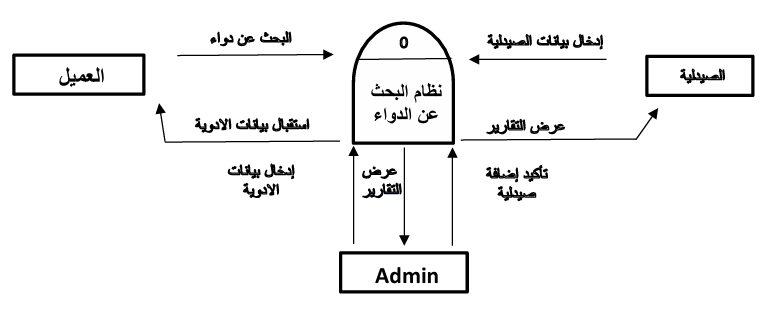

2. **تدفق البيانات في المخطط الصفري:** 

   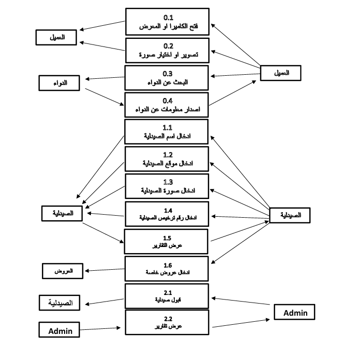

3. **الكيانات المتفاعلة في مخطط ERD:**  

   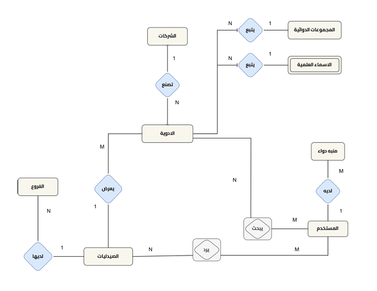

4. **مخطط Schema يبين العلاقات بين سمات الكيانات:** 

   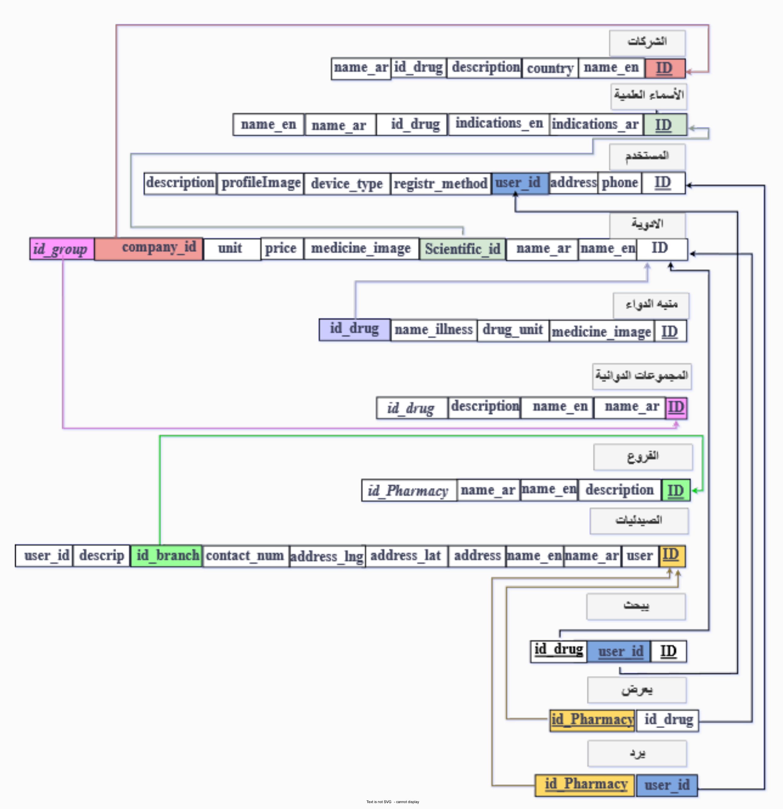

5. **خطوات عملية استخراج البيانات بتقنية التعرف الضوئي على الأحرف (OCR):**  

   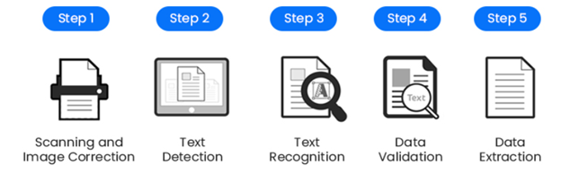

6. **خطوات عملية التعرف على الدواء:**  

   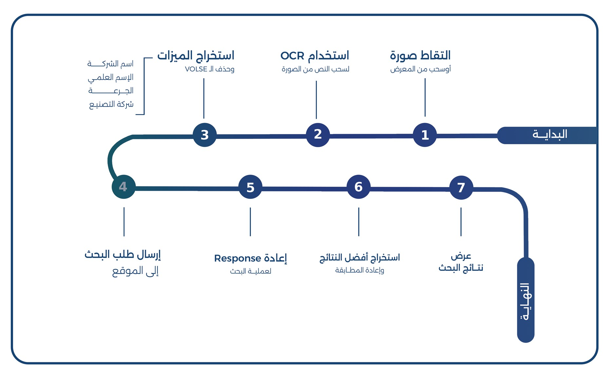

7. **جزء من مخطط هيكلة الاستخدام:**  

   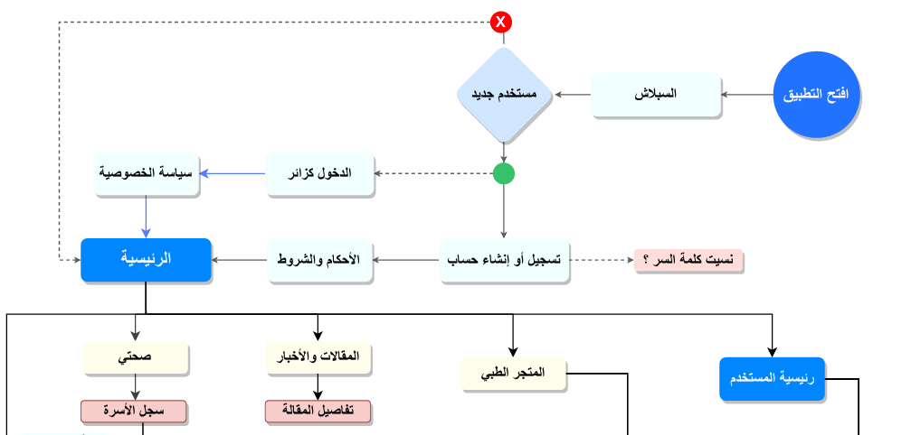

8. **جزء من نظام التصميم:**  

   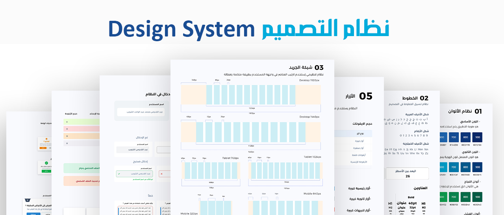

9. **مخطط بيرت التكراري يوضح المعدل الزمني لتنفيذ متطلبات المشروع:**  

   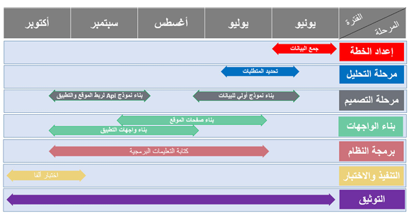

### بعض الواجهات:

- **واجهات من الموقع (لوحة تحكم الأدمن والصيدلي) :**
    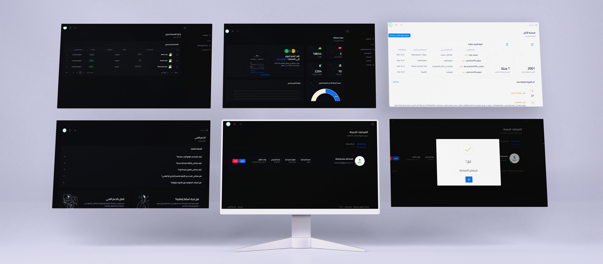

- **واجهات من تطبيق الجوال:**
    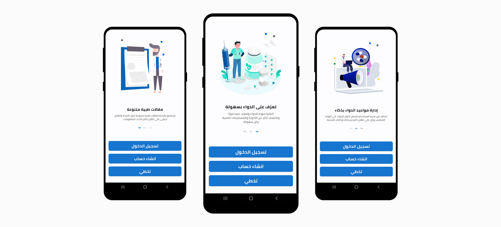
    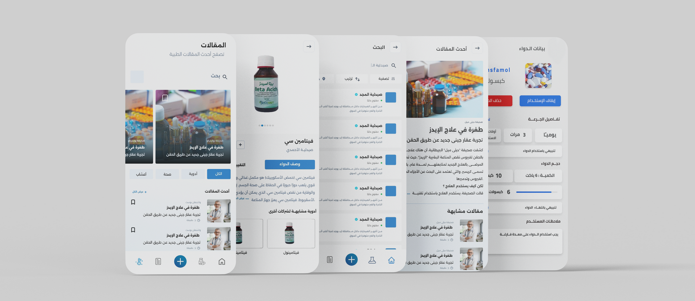
  

---

## شرح واجهات المستخدم الرئيسية 🖼️

### تطبيق الجوال

- **الصفحة الرئيسية**: عرض مختصر لأهم الميزات، الأخبار، التنبيهات، وأحدث المقالات.
- **صفحة البحث عن الأدوية**: البحث السريع بالاسم أو عبر صورة الدواء، مع عرض النتائج والتفاصيل.
- **صفحة المقالات**: استعراض المقالات الطبية والتعليمية المضافة من الإدارة.
- **صفحة تفاصيل المقالة**: عرض محتوى المقالة، اسم الكاتب، وتاريخ النشر.
- **صفحة الأدوية**: قائمة الأدوية المضافة مع إمكانية ضبط المنبه لكل دواء وزر إضافة دواء جديد.
- **صفحة إضافة دواء**: إدخال اسم الدواء، الشكل، والصورة.
- **صفحة إضافة منبه دواء**: ضبط أوقات التنبيه وفترة الاستخدام.
- **صفحة الملف الشخصي**: تفاصيل المستخدم، اللغة، مركز المساعدة، وسياسة الخصوصية.
- **صفحة نتائج البحث**: عرض أفضل تطابق للأدوية ونتائج مشابهة.
- **صفحة تفاصيل الدواء**: اسم، وصف، طريقة الاستخدام، الآثار الجانبية، وزر البحث بالخريطة.
- **صفحة الخريطة**: عرض مواقع الصيدليات القريبة.
- **صفحة الصيدلية**: تفاصيل الصيدلية مع خيارات إضافية.

### الموقع الإلكتروني

الموقع الإلكتروني يتكون من جزئين رئيسيين:

#### 1. جزء خاص بالصيدلي 🧑‍⚕️
- **صفحة تسجيل الدخول**: للصيادلة.
- **صفحة إنشاء حساب**: للصيادلة الجدد.
- **صفحة إضافة صيدلية**: بعد تسجيل الدخول.
- **نافذة إضافة البيانات الأساسية**: اسم الصيدلية، الوصف...
- **نافذة بيانات الترخيص**: رقم وصورة الترخيص.
- **صفحة انتظار الرد**: بعد تقديم الطلب.
- **الصفحة الرئيسية للصيدلية**: إدارة الأدوية والتقييم.
- **إضافة دواء**: يمكن للصيدلي إضافة دواء فقط من القائمة المتوفرة في الموقع.
- **تعديل الملف الشخصي للصيدلي**: تحديث البيانات الشخصية، إضافة فرع جديد للصيدلية، وغيرها من التعديلات المسموحة.

#### 2. جزء خاص بالإدارة (الأدمن) 🛡️
- **الصفحة الرئيسية للإدارة**: إحصائيات وقوائم المستخدمين والصيدليات.
- **صفحة إدارة المستخدمين**: عرض وتخصيص حسابات المستخدمين.
- **صفحة إدارة الصيدليات**:
    - عرض وتخصيص حسابات الصيدليات وطلبات التسجيل.
    - قبول أو رفض طلبات تسجيل الصيدليات.
    - الاطلاع على تفاصيل كل صيدلية (البيانات، الفروع، التراخيص...).
- **صفحات إدارة الأدوية**: إضافة وتحديث وحذف الأدوية أو الشركات المصنعة وغيرها من قاعدة البيانات.
- **إدارة كافة التفاصيل المتعلقة بالنظام**: مثل الأصناف، التصنيفات، التراخيص، وغيرها.

---

## طريقة تسجيل الصيدليات في النظام 🏥

1. يقوم الصيدلي بالتسجيل وإرسال المستندات المطلوبة.
2. يقوم الأدمن بمراجعة الطلب وقبوله أو رفضه.
3. بعد الموافقة، يمكن للصيدلية إضافة وإدارة الأدوية.
4. إذا انتهى الترخيص، يجب تجديده ليتمكن من العمل مجددًا.

### حالات الصيدلية

| الحالة            |                                               التوضيح             |
|--------------------------------------------------------|------------------------------ |
| مقبولة       |                  الصيدلية فعّالة ويمكنها إضافة الأدوية.                |
| مرفوضة        |                تم رفض طلب التسجيل أو تم تعطيل الحساب.               |
| منتهية الترخيص     | الترخيص منتهي ولا يمكن للصيدلية العمل إلا بعد التجديد.         |

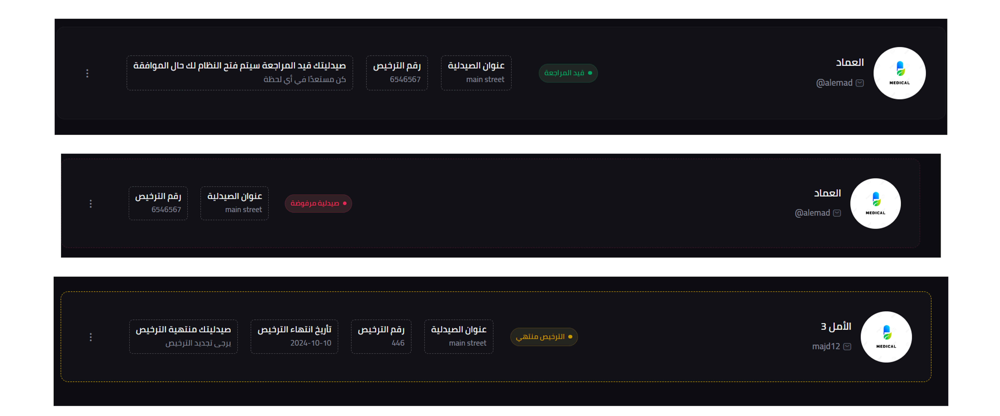

---

## فريق العمل 👨‍💻


|   |   |  |
|:--------------------------------------------------------:|:------------------------------------------------------:|:------------------------------------------------------:|
| [عبد القدوس الشويب](https://github.com/Al-shwaib)      | [عبد الله محمد قاسم](https://github.com/Abdallah-AlKhazragi)       | [لؤي الخلي](https://github.com/Loaialkhali)         |
|    |  |  |
| [عبد محمد الورد](https://github.com/ward54)                 | [عبدالعزيز دحان](https://github.com/abdulaziz49)           | [محمد الحضرمي](https://github.com/sample)      |

## للتواصل والدعم  ✉️

للاستفسارات  :- يرجى التواصل مع أحد أعضاء الفريق

> نرحب بجميع الاقتراحات لتطوير المنصة وخدمة المجتمع الطبي والصحي.

---

> منصة دواء: نحو رعاية صحية ذكية ومتطورة للجميع 🌟
